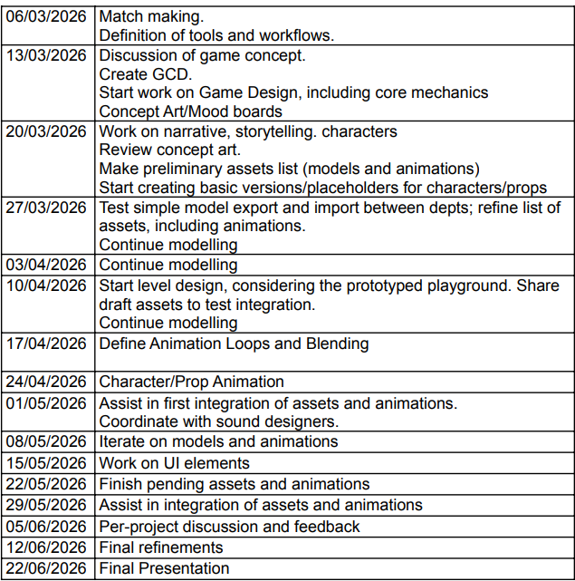
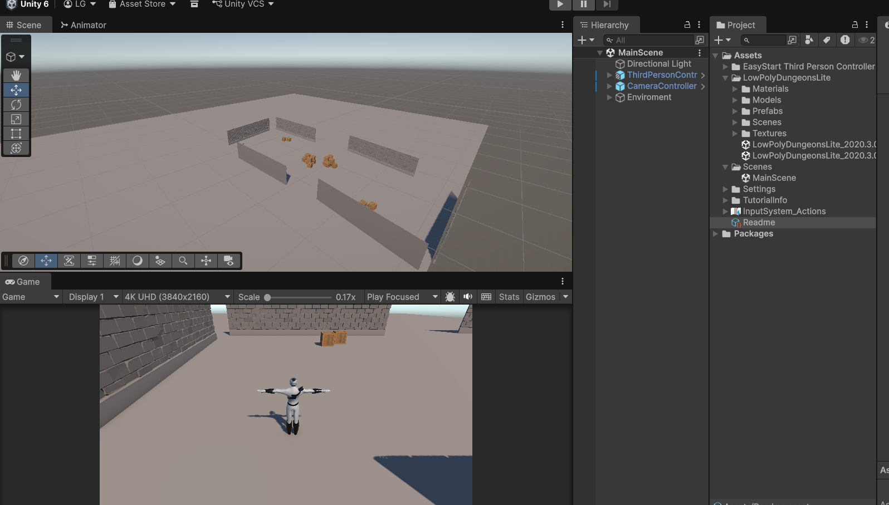
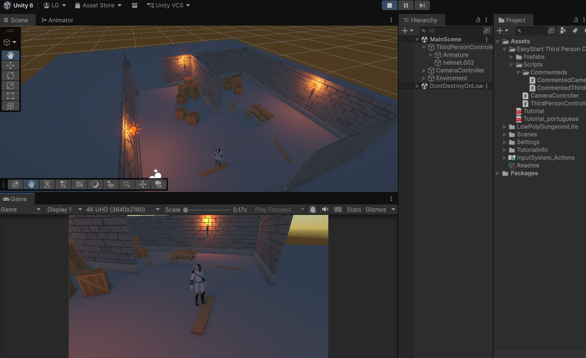

# Blood Echo - Development README

## Controles / Controls

### PS5 DualSense (Recomendado)
| Botão | Ação |
|-------|------|
| **L3 (Analog. Esq.)** | Movimentação |
| **R3 (Analog. Dir.)** | Câmera |
| **X (Cross)** | Pular / Fechar Menus |
| **○ (Circle)** | Correr (Consome Stamina) |
| **□ (Square)** | Interagir (Portas, NPCs, Itens) - *Suporte por Proximidade* |
| **△ (Triangle)** | Curar (Usar Poção) |
| **L1** | Parry |
| **Seta para cima / D-Pad Up** | Sacar / Guardar Arma |
| **R1** | Esquiva / Rolamento |
| **L2** | Ataque Leve |
| **R2** | Ataque Pesado |
| **R3 (Press)** | Travar Mira (Lock On) |

### Teclado & Mouse
| Tecla | Ação |
|-------|------|
| **W, A, S, D** | Movimentação |
| **Mouse** | Movimentar Câmera |
| **Espaço** | Pular |
| **Shift Esq.** | Correr |
| **E** | Interagir |
| **H** | Curar |
| **V** | Parry |
| **F** | Sacar / Guardar Arma |
| **R** | Esquiva / Rolamento |
| **Botão Esq. Mouse** | Ataque Leve |
| **Botão Esq. Mouse + Ctrl** | Ataque Pesado |
| **L ou Botão Meio Mouse** | Travar Mira (Lock On) |
| **Tab ou Esc** | Fechar Menus |

---

## 🛠 Mecânicas Principais (Core Mechanics)
- **Combat System**: Ataques leves e pesados, stamina e gerenciamento de fôlego.
- **Lock On System**: Trava a câmera e a rotação do personagem nos inimigos próximos.
- **Interaction System**: Sistema inteligente de interação que prioriza o que está na frente da câmera ou o objeto mais próximo do jogador.
- **Inventory & Power-ups**: Coleta de chaves, poções e melhorias permanentes (como o Ataque Pesado).
- **Bonfire System**: Pontos de descanso que recuperam vida/poções e servem como checkpoint.

## 🖼 Protótipos

